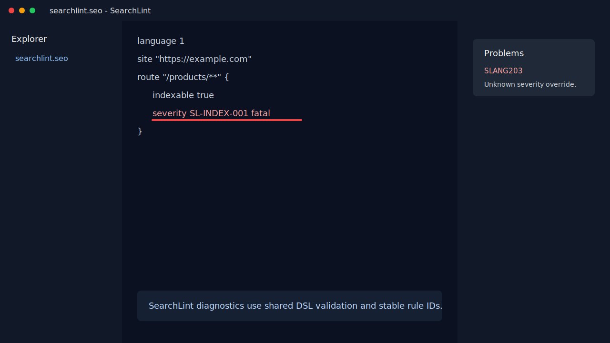
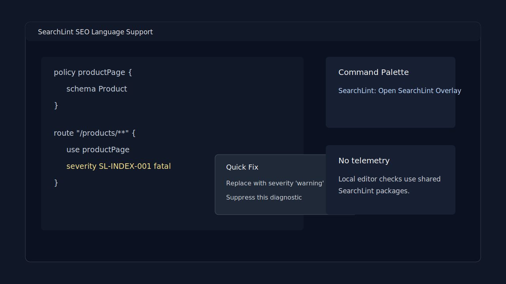

# SearchLint for VS Code

SearchLint provides language support for `searchlint.seo` files.

## Features

- Diagnostics from the shared SearchLint language parser and compiler.
- Hover help for DSL constructs and rule IDs.
- Completion for DSL keywords, severity values, providers, and known rule IDs.
- Document formatting through the shared SearchLint formatter.
- Local quick fixes for supported DSL diagnostics.
- Same-document definition, references, and rename for policies and variables.
- `SearchLint: Open SearchLint Overlay` command.

## Screenshots





## Overlay Command

Set:

```json
{
  "searchlint.overlayUrl": "http://localhost:3000"
}
```

Then run `SearchLint: Open SearchLint Overlay`.

## Privacy

This extension does not include telemetry and does not send SearchLint document
contents to SearchLint servers.

## Release Status

This package is a local release candidate. Marketplace publication, publisher
account verification, VSIX signing, and Extension Host E2E remain release gates.
